# RepoRemedy: live interactive demo

**From saved audit reports to reviewed draft PRs** · Prepared 24 September 2026

Target: **[ketanbj/reporemedy-live-fixture](https://github.com/ketanbj/reporemedy-live-fixture)**.
This guide is for macOS with a zsh/bash terminal. Keep the same terminal open while
following the numbered steps. Allow 15–20 minutes for setup and the walkthrough.
A terminal of **120 columns × 40 rows** makes review comfortable.

The screenshots are actual RepoRemedy screens using fresh, authenticated audits of
this live repository, captured at commit `3feb8d8`. They are not terminal mockups.
The captured run found **33 RepoAuditor findings** and **15 Scorecard findings**.
Counts can change when the repository or auditors change.

The main walkthrough selects **four remedies → four draft PRs**. GitHub Issues is
currently disabled on the fixture, so an optional section covers enabling Issues.
The interactive implementation is still under review in [PR #19](https://github.com/gt-csse/RepoRemedy/pull/19);
the demo branch below includes that implementation and the demo assets.

> What has been verified: both real auditors ran; RepoRemedy parsed both reports;
> the four selected remedies passed live preflight; save/resume and review worked.
> Screenshot preparation created **no new GitHub objects**. The result screenshot
> demonstrates actual reuse of existing PR #1 in a separate one-remedy session.

The fixture’s real audit reports are included in this checkout under
`demo/reports/ketanbj/reporemedy-live-fixture/`. **You do not need to install or run
either auditor for the main demo.** The optional refresh section at the end shows how.

## 1. Clone RepoRemedy and install its dependencies

Prerequisites: Git, [uv](https://docs.astral.sh/uv/getting-started/installation/),
and the [GitHub CLI](https://cli.github.com/). On macOS, install missing tools with
`brew install git uv gh` if you use Homebrew.

Paste this block in a terminal. It creates a fresh dated workspace. RepoRemedy reads
and publishes to the remote fixture; you do not need a local clone of that fixture.

```sh
export RR_WORK="$HOME/reporemedy-live-demo/run-$(date +%Y%m%d-%H%M%S)"
git clone --branch docs/interactive-live-demo --single-branch \
  https://github.com/gt-csse/RepoRemedy.git "$RR_WORK/RepoRemedy"
cd "$RR_WORK/RepoRemedy"
uv sync --frozen

export RR_REPO="ketanbj/reporemedy-live-fixture"
export RR_REPORTS="$RR_WORK/RepoRemedy/demo/reports/ketanbj/reporemedy-live-fixture"
mkdir -p "$RR_WORK/validation" "$RR_WORK/session-ra" "$RR_WORK/session-ossf"
uv run RepoRemedy inspect --help
printf '\nDemo workspace: %s\n' "$RR_WORK"
```

**Check:** help includes `--interactive`, `--plan`, `--resume` and `--ref`.
This demo branch is based on PR #19 and adds only the demo reports, screenshots
and guide. Use it until both the implementation and demo assets have landed on
`main`; the interactive implementation is currently **under review**.

## 2. Authenticate for the live fixture

```sh
gh auth status --hostname github.com || gh auth login --hostname github.com
export REPOREMEDY_TOKEN="$(gh auth token --hostname github.com)"
gh api "repos/$RR_REPO" \
  --jq '{repository: .full_name, default_branch, has_issues, can_push: .permissions.push}'
export RR_BRANCH="$(gh api "repos/$RR_REPO" --jq .default_branch)"
```

**Check:** repository is `ketanbj/reporemedy-live-fixture`, branch is `main`, and
`can_push` is `true` for publishing draft PRs. Use the fixture-owner account for this
walkthrough. Keep the token in the environment; do not paste it into input forms.

## 3. Validate both reports before opening the UI

```sh
cd "$RR_WORK/RepoRemedy"
uv run RepoRemedy inspect "$RR_REPORTS/repoauditor.txt" \
  --report-type repoauditor --repo "$RR_REPO" \
  > "$RR_WORK/validation/repoauditor-inspected.json"

uv run RepoRemedy inspect "$RR_REPORTS/scorecard.json" \
  --report-type ossf-scorecard --repo "$RR_REPO" \
  > "$RR_WORK/validation/scorecard-inspected.json"

uv run python - <<'PY'
from collections import Counter
import json, os
from pathlib import Path
root = Path(os.environ['RR_WORK']) / 'validation'
for name in ['repoauditor', 'scorecard']:
    report = json.loads((root / f'{name}-inspected.json').read_text())
    print(name, len(report['issues']), 'findings', dict(Counter(i['status'] for i in report['issues'])))
PY
```

**Captured result:** RepoAuditor: 33 findings; Scorecard: 15 findings, including
unavailable checks. Unavailable evidence is not a confirmed defect. These are
separate audit sources: the current UI takes **one report per plan**, not a merged
RepoAuditor+Scorecard input.

## 4. Start interactive inspection

```sh
env -u NO_COLOR uv run RepoRemedy inspect "$RR_REPORTS/repoauditor.txt" \
  --report-type repoauditor --repo "$RR_REPO" \
  --ref "$RR_BRANCH" --interactive \
  --plan "$RR_WORK/session-ra/plan.json"
```

`--ref` explicitly targets the audited branch. If omitted, new interactive sessions
use an audited commit when available, otherwise the repository’s default branch.

1. Browse findings using arrow keys; the evidence panel shows the selected finding.
2. Choose **Continue to remedy selection**.
3. Wait for repository context collection. It reads GitHub; it does not publish.

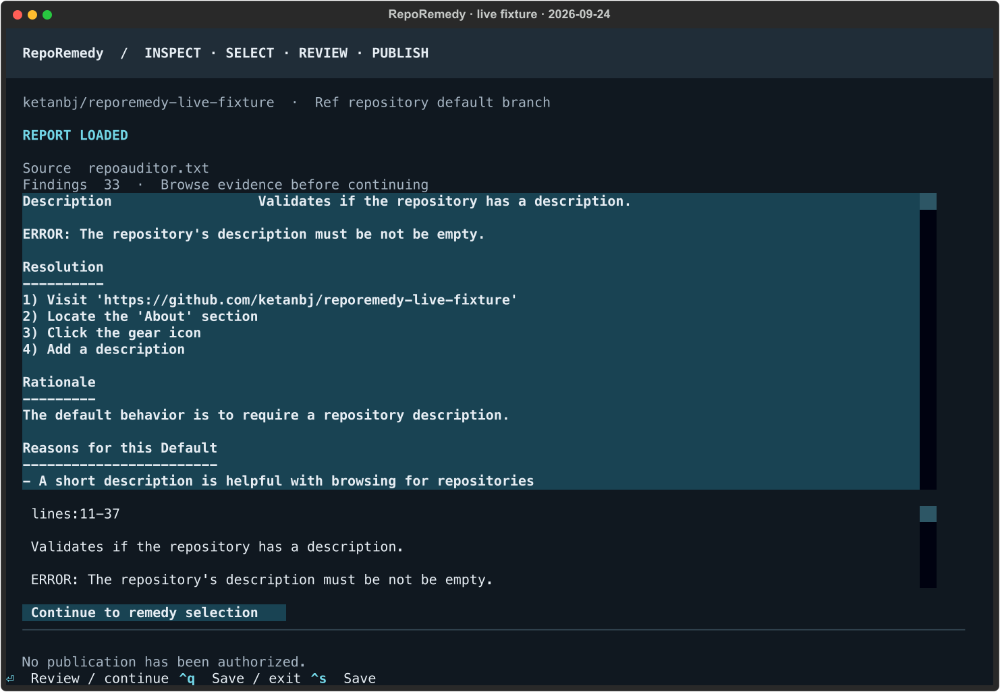

*Actual inspection screen. The capture used the default-branch lookup; the command
above explicitly supplies the same `main` branch.*

## 5. Select four remedies and try search/filter

Select these rows **in this order** so the following review screenshots match.
Use `/` to search the ID, `Escape` to return focus to the list, and `Space` to select.
Search again for the next remedy; hidden selections remain selected.

| Order | Search text | Result after publication |
| --- | --- | --- |
| 1 | `ra-read-me` | Draft PR adding `README.md` |
| 2 | `ra-contributing` | Draft PR adding `CONTRIBUTING.md` |
| 3 | `ra-issue-templates` | One draft PR adding two issue-template files |
| 4 | `ra-pull-request-template` | Draft PR adding `.github/pull_request_template.md` |

Clear search: press `/`, then `Ctrl+A`, `Backspace`, `Escape`.
The summary should show **4 selected**. The full list contains 33 findings in the
captured run; readiness is separate from selection.

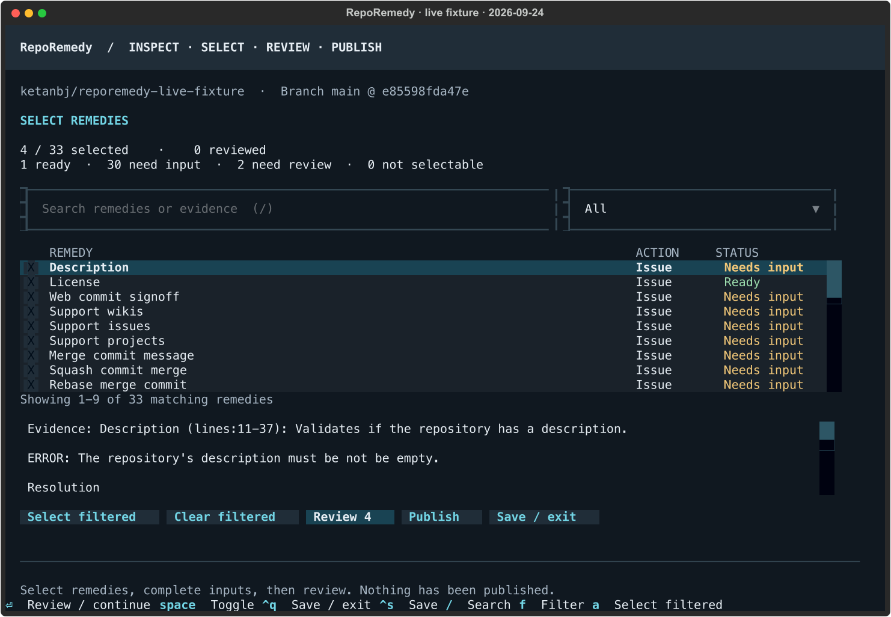

Try searching `contributing`. Matching rows are visible (README evidence also mentions contributing), while
the selection count stays four. Use `F` and choose **Selected** to show all four selected remedies, then
return the filter to **All** and clear search.

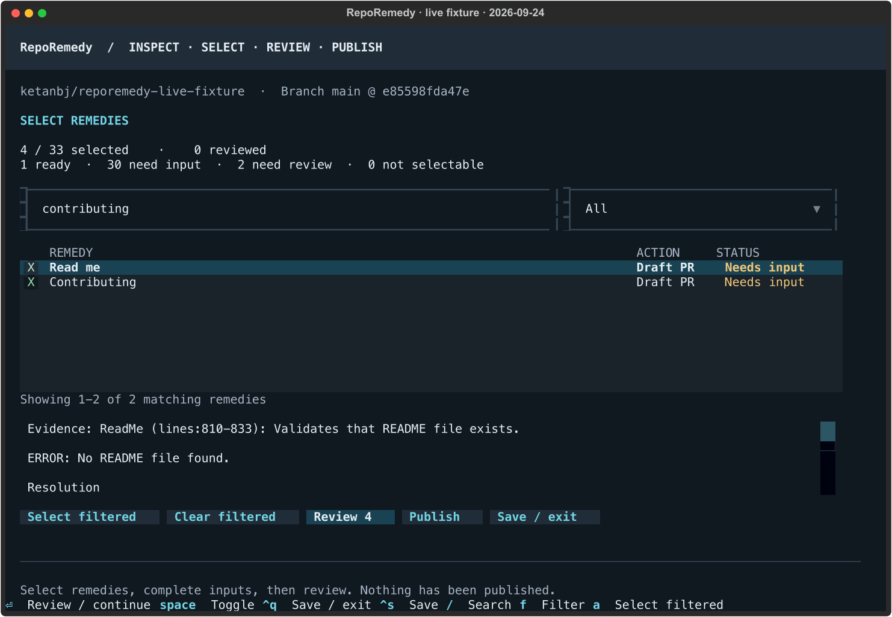

For a bulk-selection exercise, press `A` with All/empty search to select eligible
rows, then clear them with **Clear filtered** before restoring the four above.
This real audit has 33 findings, so do not expect the synthetic demo’s 40-row count.

## 6. Fill README inputs, then save an unfinished draft

Choose **Review**. Press `E` for **Edit inputs / route**. Keep the route **Draft PR**.
Use `Tab` to move between controls; click a text field and use `Ctrl+A` to replace
its contents. Fields scroll vertically. Enter inserts a newline in a form;
**Generate preview** is a button or `Ctrl+Enter`.

Paste these fixture-specific values. Keep the existing **Verification steps** text.

**Project name**

```text
RepoRemedy live fixture
```

**Project summary**

```text
An intentionally incomplete repository for exercising audit and remediation workflows. Not a production application.
```

**Installation instructions**

```text
Clone https://github.com/ketanbj/reporemedy-live-fixture. No runtime installation is required for this documentation demo.
```

**Usage instructions**

```text
Audit this fixture, select remedies in RepoRemedy, review proposals, and publish draft PRs.
```

**Support instructions**

```text
Contact the fixture owner for demo questions. Do not submit secrets or real vulnerability reports here.
```

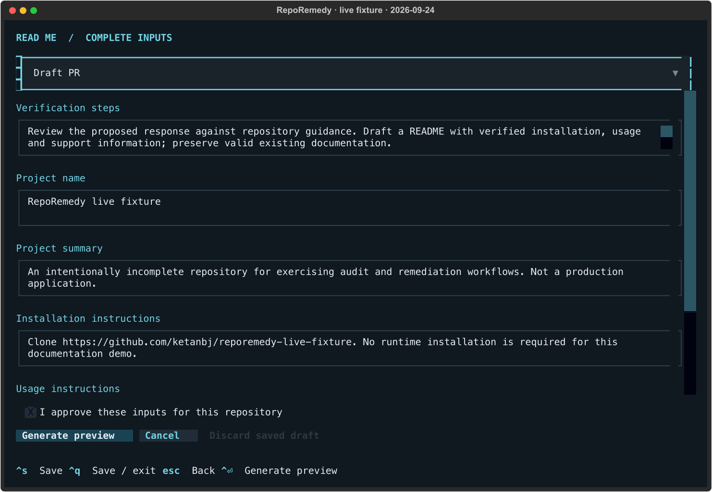

Now press **Ctrl+S**, then **Ctrl+Q while still inside the form**. Do not generate
the preview yet. The UI exits and saves the form as an **unapproved input draft**.
Saving never means approving or publishing.

## 7. Resume, restore inputs, and review the exact diff

```sh
env -u NO_COLOR uv run RepoRemedy inspect \
  --resume "$RR_WORK/session-ra/plan.json"
```

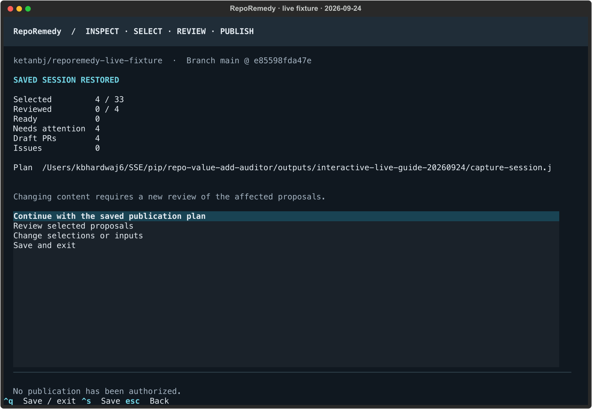

1. Choose **Review selected proposals** on the restored-session screen.
2. The preview cannot be approved while an unapplied draft exists. Press `E`.
3. Confirm the values were restored. Leave **Draft PR** selected.
4. Check **I approve these inputs for this repository**.
5. Choose **Generate preview** (`Ctrl+Enter`).

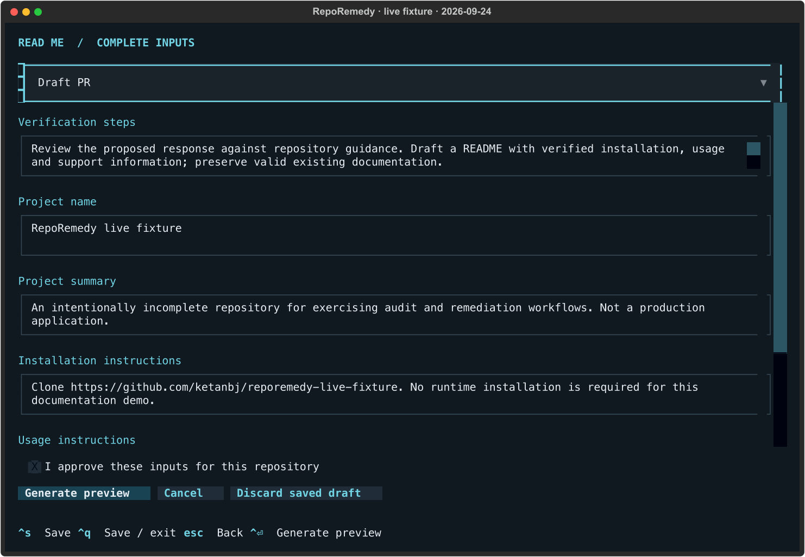

Scroll through the generated diff and complete PR description. Confirm the repository
and proposed file content, then choose **Approve / next** (`Enter`). Input approval
and content review are two separate actions.

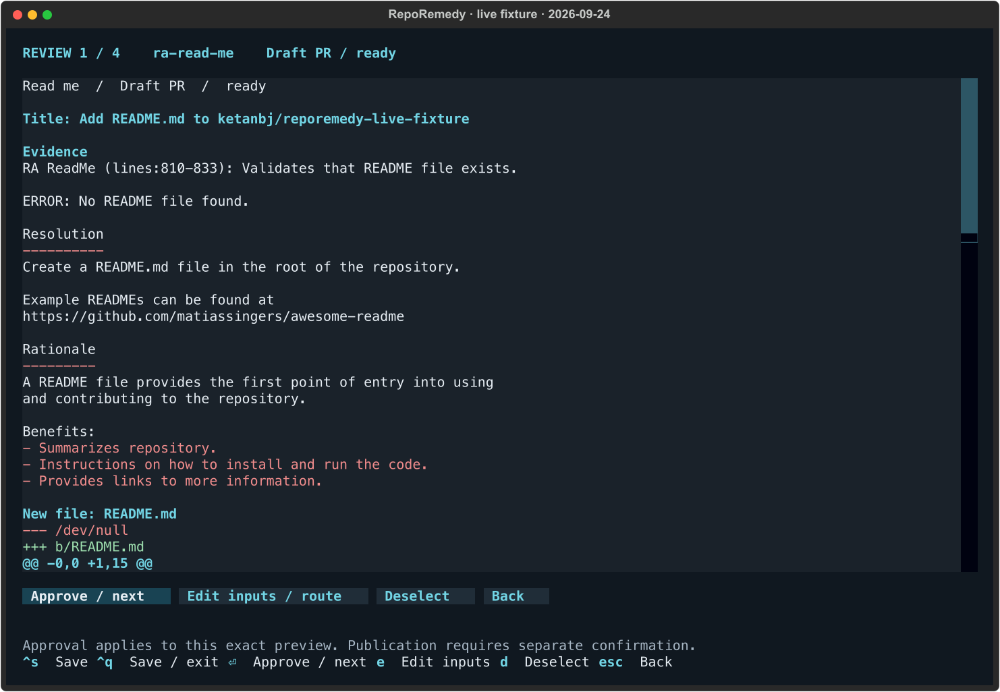

To exercise the alternative: **Discard saved draft** removes the unapplied edits;
it does not approve a proposal. **Cancel** closes the form without applying unsaved
edits, while an already saved draft remains available.

## 8. Complete the other three reviews

For **Contributing**, press `E`, keep **Draft PR**, and paste these values. Keep the
existing verification steps.

**Development setup**

```text
Clone https://github.com/ketanbj/reporemedy-live-fixture. This documentation demo needs no build step.
```

**Test instructions**

```text
Review the Markdown and rerun RepoAuditor. No executable test suite is provided for this fixture.
```

**Contribution process**

```text
Open a draft PR targeting main. Leave demo PRs unmerged so repeated demo runs can reuse them.
```

Check input approval → Generate preview → inspect the diff → Approve / next.

For **Issue templates** and **Pull request template**, also press `E`, review the
supplied verification text, check input approval and generate the preview. These
routes do not need new project-policy fields, but still require input/content review.
Verify that Issue templates contains **two file diffs in one PR**, then approve each proposal.

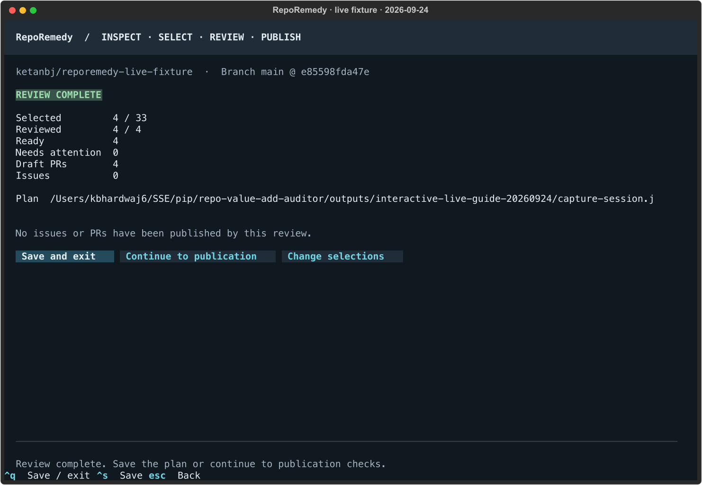

**Check:** Selected 4; Reviewed 4; Ready 4; Draft PRs 4; Issues 0.
Choose **Save and exit** for a clean handoff to publication.

Optional approval-invalidation test: resume, edit an already reviewed input and save
it as a draft. Its content review becomes invalid; publication must stay blocked until
you apply the input and approve the new preview.

## 9. Open publication checks and explicitly publish

```sh
env -u NO_COLOR uv run RepoRemedy publish \
  --plan "$RR_WORK/session-ra/plan.json"
```

Read-only preflight checks the selected content, target branch, live evidence,
publication route, existing matches and receipt state. The header displays the
resolved branch and commit. The capture below passed with **4 new / 0 reused / 0 blocked**.
If you already ran the demo, existing matches can be reported instead.

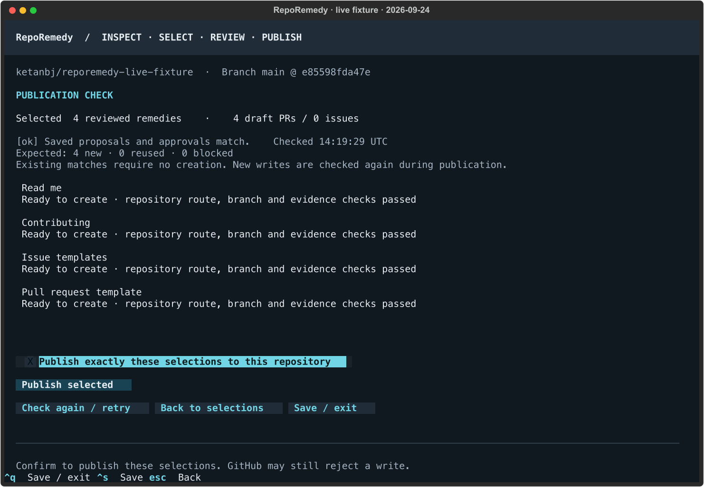

To perform the live write yourself:

1. Verify the target is **ketanbj/reporemedy-live-fixture**, branch **main**.
2. Check **Publish exactly these selections to this repository**.
3. Choose **Publish selected**.
4. Watch the progress and final result counts. Each completed result is saved to
   the receipt journal before moving to the next remedy.
5. Select a result and choose **Open selected result** to inspect its GitHub PR.

**This step creates real draft PRs.** Leave them unmerged during the demo. Creating
a draft PR does not apply its files to `main`; merging is a separate maintainer action.
New writes are validated again, so passing preflight does not guarantee that a later
write cannot be rejected.

After saving/exiting the UI, inspect the results from the shell:

```sh
gh pr list --repo "$RR_REPO" --state open \
  --json number,title,isDraft,baseRefName,url
uv run python -m json.tool "$RR_WORK/session-ra/publication-receipts.json"
```

First-run expectation: four draft PRs targeting main, plus any previously existing
fixture PRs. Existing security-policy PR #1 is separate from these four selections.
If publication stops partway through, retain the plan and receipts; do not delete the
journal to force a retry. Use **Check again / retry** after addressing the blocker.

## 10. Repeat and demonstrate duplicate reuse

Reopen the same reviewed plan:

```sh
env -u NO_COLOR uv run RepoRemedy publish \
  --plan "$RR_WORK/session-ra/plan.json"
```

Preflight should now show the four existing matches. Confirm again to exercise reuse.
Expected result after a successful first run: **0 new objects; 4 reused results**.
Keep the same receipt journal. A just-created PR may take a short time to appear in
GitHub list results; if reconciliation is temporarily blocked, wait and check again.

The next two screenshots show a **separate, real one-remedy reuse demonstration**,
using the fixture’s already existing Security policy PR #1. They are not a claim
that the four-PR creation step above was executed during guide preparation.

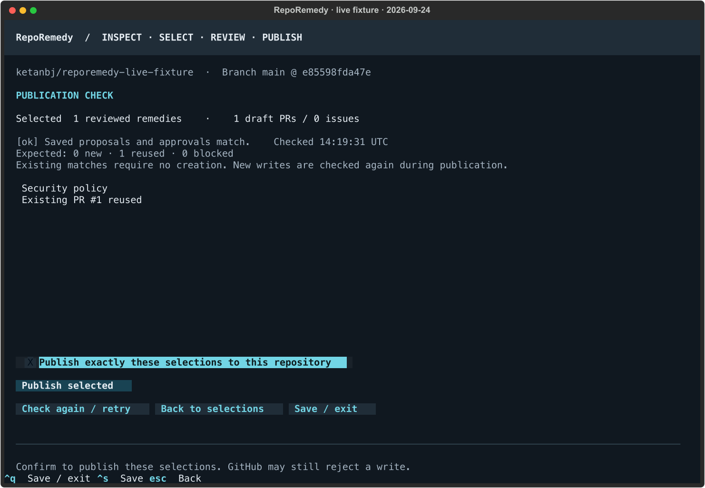

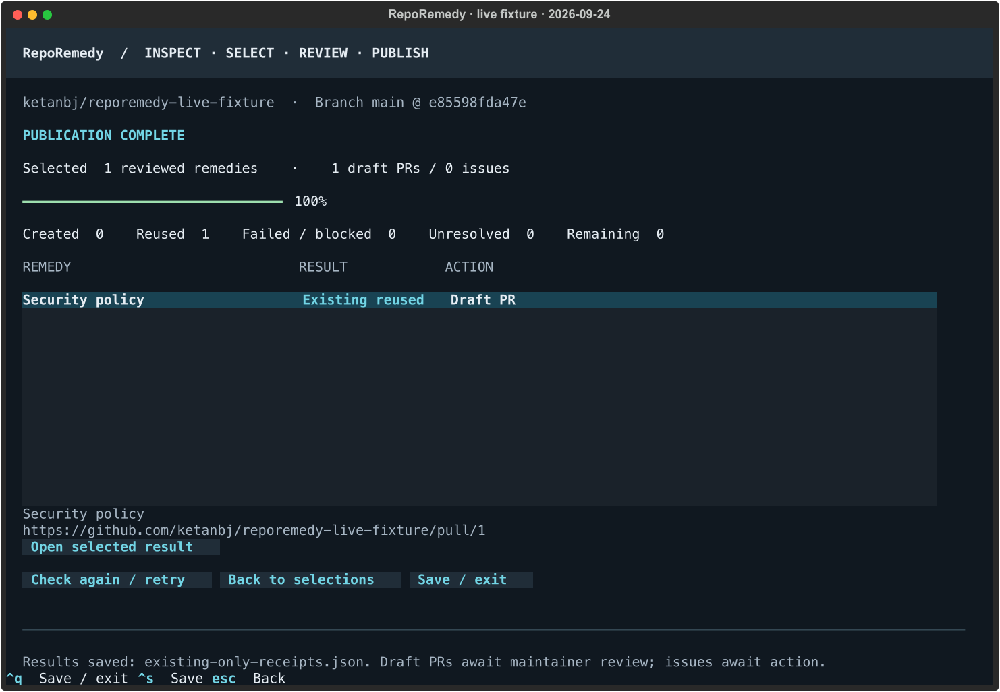

To reproduce that one-remedy example yourself, resume the RA plan, choose **Change
selections or inputs**, clear the four selections and select **Security policy**.
Review its Draft PR route using the two values below, then continue through preflight
and confirmation. Save the plan after changing selections.

**Security reporting instructions**

```text
Demo fixture only; no real vulnerability-reporting service is provided. Do not submit sensitive information here.
```

**Supported versions**

```text
Synthetic fixture only; no production releases are supported.
```

RepoRemedy matches existing managed markers or identical titles across the repository,
including closed objects and different branches. PR #1 targets
`fixture/publication-20260918`; reuse does **not** retarget it to main, update its body,
or apply your newly reviewed file content. Check the reused object’s actual scope.

## 11. Exercise the Scorecard input path separately

```sh
env -u NO_COLOR uv run RepoRemedy inspect "$RR_REPORTS/scorecard.json" \
  --report-type ossf-scorecard --repo "$RR_REPO" \
  --interactive --plan "$RR_WORK/session-ossf/plan.json"
```

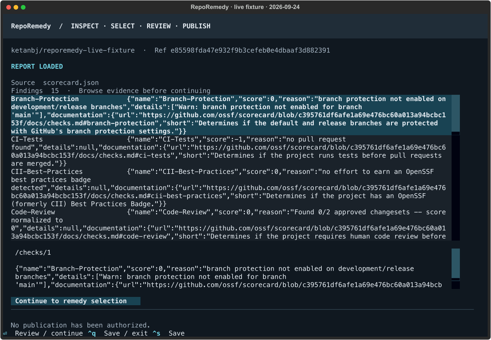

1. Browse Scorecard evidence, including numeric scores and unavailable checks.
2. Continue to selection and verify unavailable findings remain unselectable.
3. Select **Security policy**, complete the two fields from step 10, generate and
   review the preview, then save/exit.
4. Resume the Scorecard plan with the command below. If you publish this selection,
   expect PR #1 reuse as described above; this is not a second independent security fix.

```sh
env -u NO_COLOR uv run RepoRemedy inspect \
  --resume "$RR_WORK/session-ossf/plan.json"
```

Do not concatenate the two audit files or feed the normalized `*-inspected.json`
files back as raw auditor reports. Each plan has its own directory and receipts.

## 12. Optional: exercise GitHub issue publication

At preparation time this fixture had **Issues disabled**. To exercise the blocker,
select Description in an RA session, fill its policy inputs, generate and review
an Issue preview, then open preflight. Publication should be blocked for that route.

For the full issue-publication path, the fixture owner can explicitly enable Issues:

```sh
gh repo edit "$RR_REPO" --enable-issues
gh api "repos/$RR_REPO" --jq .has_issues
```

This changes a real repository setting. Do it **before collecting the context for
the issue-publication session**. Use the optional audit refresh section below and a fresh session after
changing settings; SupportIssues is no longer the same finding. The existing
four-PR plan and its receipts should be retained for repeat demonstrations.

Select **Description** and choose the **Issue** route. Use these policy values:

**Reported expected value**

```text
Provide a nonempty description that identifies this repository as a demo fixture.
```

**Approved value**

```text
RepoRemedy synthetic demo fixture; not a production project.
```

Keep the resolved setting location and verification steps; approve inputs, review
the exact issue body and confirm publication after preflight. RepoRemedy creates
an issue requesting the change; it does not change the repository description itself.

## Recovery and repeat-run checklist

| Situation | What to do |
| --- | --- |
| “Plan already exists” | Use `inspect --resume` with that path, or start a new dated workspace. |
| Need a different target branch | Start a new inspection with `--ref`; resume cannot override a reviewed target. |
| Missing input or unapplied draft | Edit, complete and approve inputs; then review the generated content. |
| Target branch/evidence changed | Rerun the audit and create/review a fresh plan. Do not edit provenance hashes. |
| Issue route is blocked | Verify `has_issues`; use the four-PR path or explicitly enable Issues before a fresh session. |
| Publication partly succeeded | Keep receipts, inspect returned links and unresolved entries, then Check again / retry. |
| Catalog changed after upgrading | Generate/review a new plan with the new implementation. |
| Ctrl+Enter is not sent by the terminal | Click **Generate preview** or Tab to the button and press Enter. |
| Authentication errors | Run `gh auth status`, refresh the environment token and reopen the saved plan. |

For a new shell, recover the most recent demo workspace and reauthenticate:

```sh
export RR_WORK="$(find "$HOME/reporemedy-live-demo" -mindepth 1 -maxdepth 1 -type d -name 'run-*' | sort | tail -n 1)"
export RR_REPO="ketanbj/reporemedy-live-fixture"
export RR_REPORTS="$RR_WORK/RepoRemedy/demo/reports/ketanbj/reporemedy-live-fixture"
export RR_BRANCH="$(gh api "repos/$RR_REPO" --jq .default_branch)"
export REPOREMEDY_TOKEN="$(gh auth token --hostname github.com)"
cd "$RR_WORK/RepoRemedy"
env -u NO_COLOR uv run RepoRemedy inspect --resume "$RR_WORK/session-ra/plan.json"
```

Do not merge the fixture PRs until you are finished demonstrating reuse. Closing an
existing PR does not make RepoRemedy recreate it: duplicate detection includes closed
objects. A genuinely clean publication replay requires a fresh fixture or reconciled
existing objects, not deletion of local receipts.

## Optional: refresh the reports from GitHub

Skip this section for the saved-report walkthrough. Run it when the fixture changes
or when you want to demonstrate audit generation too. It writes fresh exports outside
the checkout. Use a **new plan directory** afterward so previous approvals and receipts
stay associated with their original report.

```sh
export RR_AUDITS="$RR_WORK/fresh-audits-$(date +%Y%m%d-%H%M%S)"
mkdir -p "$RR_AUDITS" "$RR_WORK/tools"
export GITHUB_AUTH_TOKEN="$REPOREMEDY_TOKEN"
uv python install 3.13
```

Install the auditor in an isolated, pinned tool environment. These versions were
verified together; an unconstrained installation failed to start during preparation.
This does not replace RepoRemedy’s dependencies.

```sh
uv tool run --python 3.13 \
  --from 'RepoAuditor==0.4.8' \
  --with 'typer==0.15.4' --with 'click==8.1.8' \
  RepoAuditor --version
```

**Check:** `RepoAuditor v0.4.8`.

The following downloads Scorecard 5.5.0 from its official release, checks the archive
checksum and installs it only inside this demo folder. Both Apple Silicon and Intel
Macs are supported.

```sh
case "$(uname -m)" in
  arm64) RR_ARCH=arm64 ;;
  x86_64) RR_ARCH=amd64 ;;
  *) printf 'Unsupported Mac architecture\n'; return 1 ;;
esac
export RR_ARCHIVE="scorecard_5.5.0_darwin_${RR_ARCH}.tar.gz"
gh release download v5.5.0 --repo ossf/scorecard \
  --pattern "$RR_ARCHIVE" --pattern scorecard_checksums.txt \
  --dir "$RR_WORK/tools" --clobber

uv run --no-project --python 3.13 python - <<'PY'
import hashlib, os, tarfile
from pathlib import Path
root = Path(os.environ['RR_WORK']) / 'tools'
archive = root / os.environ['RR_ARCHIVE']
expected = next(line.split()[0] for line in (root / 'scorecard_checksums.txt').read_text().splitlines()
                if line.split()[-1] == archive.name)
assert hashlib.sha256(archive.read_bytes()).hexdigest() == expected, 'Checksum mismatch'
with tarfile.open(archive) as package:
    package.extractall(root, filter='data')
print('Scorecard checksum verified')
PY

"$RR_WORK/tools/scorecard" version
```

**Check:** `GitVersion: v5.5.0`. The command is `version`, not `--version`.
See the [official Scorecard installation/authentication documentation](https://github.com/ossf/scorecard/blob/main/README.md).

### Refresh the RepoAuditor report

This runs the **GitHub**, **CommunityStandards** and **ScientificSoftware** modules.
The temporary PAT file is private and removed when the subshell exits. The exported
report is kept separate from console output so RepoRemedy can parse intact panels.

```sh
(
  umask 077
  RR_PAT_FILE="$(mktemp)"
  trap 'unlink "$RR_PAT_FILE"' EXIT
  gh auth token --hostname github.com > "$RR_PAT_FILE"

  if NO_COLOR=1 uv tool run --python 3.13 \
    --from 'RepoAuditor==0.4.8' \
    --with 'typer==0.15.4' --with 'click==8.1.8' \
    RepoAuditor \
    --include GitHub \
    --GitHub-url "https://github.com/$RR_REPO" \
    --GitHub-branch "$RR_BRANCH" --GitHub-pat "$RR_PAT_FILE" \
    --include CommunityStandards \
    --CommunityStandards-url "https://github.com/$RR_REPO" \
    --CommunityStandards-branch "$RR_BRANCH" \
    --include ScientificSoftware \
    --ScientificSoftware-url "https://github.com/$RR_REPO" \
    --ScientificSoftware-branch "$RR_BRANCH" \
    --output "$RR_AUDITS/repoauditor.txt" \
    > "$RR_AUDITS/repoauditor.log" 2>&1
  then
    RR_AUDIT_EXIT=0
  else
    RR_AUDIT_EXIT=$?
  fi
  printf 'RepoAuditor exit code: %s\n' "$RR_AUDIT_EXIT"
  case "$RR_AUDIT_EXIT" in
    0|255) test -s "$RR_AUDITS/repoauditor.txt" ;;
    *) tail -n 30 "$RR_AUDITS/repoauditor.log"; exit "$RR_AUDIT_EXIT" ;;
  esac
)
```

**Expected on this fixture:** exit `255` with a nonempty report. RepoAuditor uses
nonzero exit codes for findings as well as errors; exit 255 alone is not proof of
success. The reader check in step 3 is required. Do not substitute the `.log` file
for the exported `.txt` report.

[RepoAuditor source and usage](https://github.com/gt-csse/RepoAuditor) describe the module-based audit interface.

### Refresh the Scorecard report

```sh
"$RR_WORK/tools/scorecard" \
  --repo="github.com/$RR_REPO" --format=json --show-details \
  > "$RR_AUDITS/scorecard.json" 2> "$RR_AUDITS/scorecard.log"
```

**Check:** exit code 0 and nonempty JSON. If it fails, inspect
`tail -n 30 "$RR_AUDITS/scorecard.log"`; resolve authentication/network errors before
continuing. No repository settings or files are changed by either audit.

Point inspection at the new exports, validate as in step 3, then start a fresh session:

```sh
export RR_REPORTS="$RR_AUDITS"
export RR_FRESH_SESSION="$RR_WORK/session-refresh-$(date +%Y%m%d-%H%M%S)"
mkdir -p "$RR_FRESH_SESSION"
env -u NO_COLOR uv run RepoRemedy inspect "$RR_REPORTS/repoauditor.txt" \
  --report-type repoauditor --repo "$RR_REPO" --ref "$RR_BRANCH" \
  --interactive --plan "$RR_FRESH_SESSION/plan.json"
```

## Evidence included with this guide

- [RepoAuditor export](../../demo/reports/ketanbj/reporemedy-live-fixture/repoauditor.txt), [Scorecard JSON](../../demo/reports/ketanbj/reporemedy-live-fixture/scorecard.json), and [audit provenance](../../demo/reports/ketanbj/reporemedy-live-fixture/manifest.json).
- [Input examples](input-examples.json), [capture verification](capture-verification.json), and 12 actual Textual screen captures.
- RepoRemedy implementation `3feb8d8`; audited fixture base `e85598fda47e932f9b3cefeb0e4dbaaf3d882391`.
- [Interactive workflow reference](../interactive.md).

Start at step 1 to create your own plan, approvals and receipt journal. The screenshots
record a verified preflight and existing-PR reuse; they do not claim four new PRs were
created during guide preparation.
