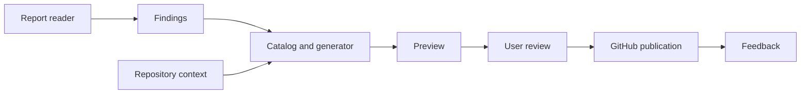

# RepoRemedy design

RepoRemedy turns audit findings into reviewable improvements for open-source
repositories. This is the proposed design at this point is expected to update. 

## Workflow

1. **Inspect** a RepoAuditor text report or OpenSSF Scorecard JSON report.
2. **Preview** remedies using the report, [catalog](catalog.md) and current repository context.
3. **Review** the evidence, proposed changes, missing inputs and validation steps.
4. **Publish** selected proposals after confirmation: settings issues or draft PRs for file changes.
5. **Collect feedback** from maintainers: accepted, declined, changes requested or pending.

Support one repository or batches of 5–10. Preview makes no GitHub changes.
Before publication, recheck the target content and avoid duplicates, including on retries.

## Reports

| Format | Handling |
| --- | --- |
| RepoAuditor text | Read intact saved reports. Retain check identifiers, status and evidence; distinguish Warning/Error findings from audit failures. Success/DoesNotApply do not trigger fixes. |
| OpenSSF Scorecard JSON | Support v5 reports, including raw JSON and the `{meta, scorecard}` objects/arrays from oss-security-audit-tools. Scores 0–9 are candidate gaps, 10 is passing, and -1 is unavailable. |

Rejects malformed, unsupported or ambiguous inputs, keeps unknown checks visible and missing data is not proof of a defect.

## Architecture

Readers normalize findings; generators prepare proposals; the publisher writes only
selected, validated changes. Store evidence, diffs and publication receipts locally
so users can review results and resume interrupted work. Isolate failures within batches.

## Modes and technology

| Area | Choice |
| --- | --- |
| Runtime and packaging | Python 3.14+, uv and uv_build; MIT license. |
| Planned CLI | Typer; target launch is `uvx RepoRemedy` once implemented and published. |
| Planned data and HTTP clients | Pydantic for validated models; HTTPX for GitHub and model APIs. |
| `non-llm` | Default mode using fixed catalog responses. |
| `local-llm` | Proposals generated through a configured Ollama endpoint. |
| `llm` | Proposals generated through a configured hosted OpenAI-compatible endpoint. |
| Quality checks | Ruff, ty, pytest, pre-commit and GitHub Actions; 95% coverage gate. |

All modes use the same review and publication flow. Show what context is sent to
hosted models; keep credentials out of artifacts and treat generated content as untrusted.

## Scope and delivery

Start with documentation remedies and administrator instructions. RepoRemedy does not
execute target code, change settings directly or merge PRs automatically.
