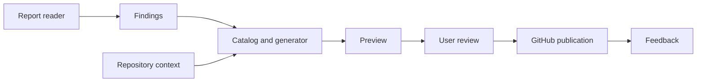
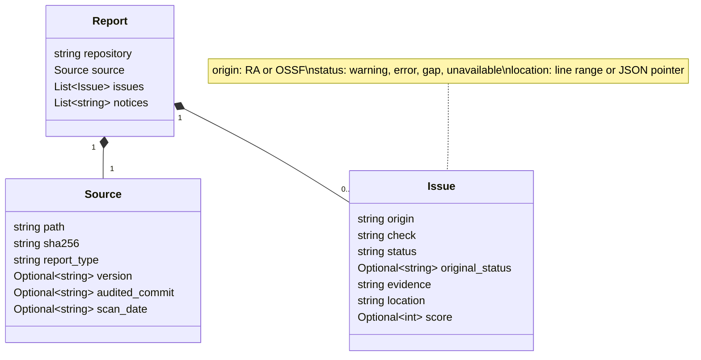

# RepoRemedy design

RepoRemedy turns audit findings into reviewable improvements for open-source
repositories. This is the proposed design at this point is expected to update. 

## Workflow

1. **Inspect** a RepoAuditor text report or OpenSSF Scorecard JSON report.
2. **Preview** remedies using the report, [catalog](catalog.md) and current repository context.
3. **Review** the evidence, proposed changes, missing inputs and validation steps.
4. **Publish** selected proposals after confirmation: settings issues or draft PRs for file changes.
5. **Collect feedback** from maintainers: accepted, declined, changes requested or pending.

Support one repository or batches of 5–10. Preview makes no GitHub changes.
Before publication, recheck the target content and avoid duplicates, including on retries.

## Reports

| Format | Handling |
| --- | --- |
| RepoAuditor text | Read intact saved reports. Retain check identifiers, status and evidence; distinguish Warning/Error findings from audit failures. Success/DoesNotApply do not trigger fixes. |
| OpenSSF Scorecard JSON | Support v5 reports, including raw JSON and the `{meta, scorecard}` objects/arrays from oss-security-audit-tools. Scores 0–9 are candidate findings (`gap`), 10 is the maximum and is omitted, and -1 is `unavailable`. |

Rejects malformed, unsupported or ambiguous inputs, keeps unknown checks visible and missing data is not proof of a defect.

RepoAuditor's `Incomplete data was encountered` diagnostic maps to `unavailable`,
preserving `original_status` (`Warning` or `Error`) and the source evidence.
Other warnings/errors keep their normalized status. Scorecard preserves its original
numeric `score`; `original_status` is null because it has no equivalent status label.

RepoAuditor Metrics panels, when present, must be intact and agree with the saved
warning/error counts; successful/skipped panels may be omitted by the exporter.
Every text report carries a completeness-unverified notice: module summaries cannot
prove that all requested modules were saved. Reports without Metrics remain readable
with this notice; successful parsing does not establish a complete audit.

`MAX_SCORE = 10` is Scorecard's maximum value, not a universal pass/fail threshold.
A `gap` marks a candidate finding for review, not a confirmed defect or an automatic
remedy. Check-specific criteria and repository context belong in remedy selection.
Retaining all check results and moving filtering to that stage is planned; the
current reader still omits score-10 checks.

## Architecture

Readers normalize findings; generators prepare proposals; the publisher writes only
selected, validated changes. Store evidence, diffs and publication receipts locally
so users can review results and resume interrupted work. Isolate failures within batches.

### Common issue model

Both readers return the same Pydantic [report and issue models](../src/RepoRemedy/models.py).
A report contains repository identity, source provenance and normalized issues.
`Optional` fields may be null.

## Modes and technology

| Area | Choice |
| --- | --- |
| Runtime and packaging | Python 3.14+, uv and uv_build; MIT license. |
| CLI | Typer with `inspect`, `--help` and `--version`; install from the checkout until a release is published. |
| Data and HTTP clients | Pydantic validates reports and issues. HTTPX remains planned for GitHub and model APIs. |
| `non-llm` | Default mode using fixed catalog responses. |
| `local-llm` | Proposals generated through a configured Ollama endpoint. |
| `llm` | Proposals generated through a configured hosted OpenAI-compatible endpoint. |
| Quality checks | Ruff, ty, pytest, pre-commit and GitHub Actions; 95% coverage gate. |

All modes use the same review and publication flow. Show what context is sent to
hosted models; keep credentials out of artifacts and treat generated content as untrusted.

## Scope and delivery

Start with documentation remedies and administrator instructions. RepoRemedy does not
execute target code, change settings directly or merge PRs automatically.
