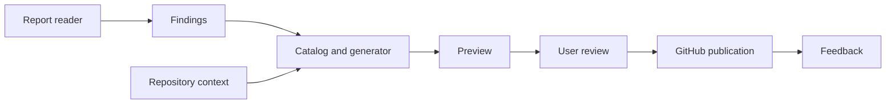
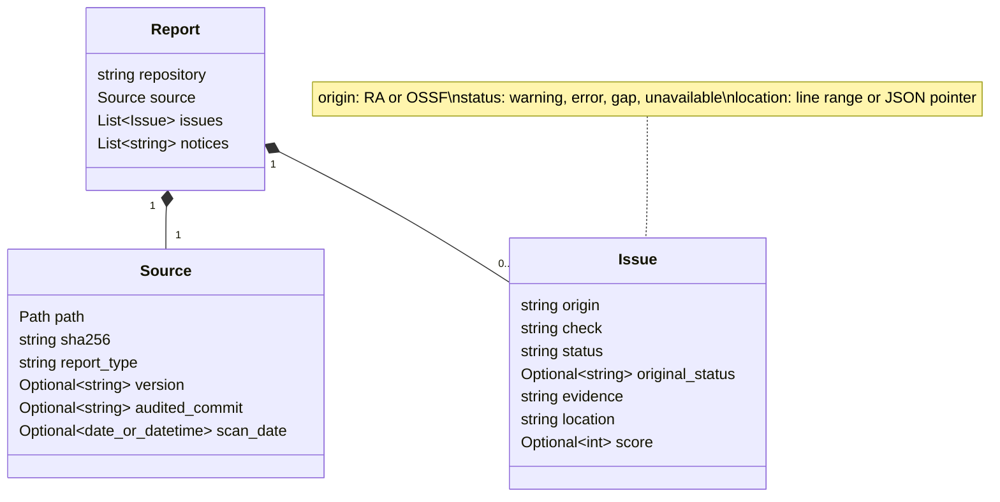

# RepoRemedy design

RepoRemedy turns audit findings into reviewable improvements for open-source
repositories. This is the proposed design at this point is expected to update. 

## Workflow

1. **Inspect** a RepoAuditor text report or OpenSSF Scorecard JSON report.
2. **Preview** remedies using the report, [catalog](catalog.md) and current repository context.
3. **Review** the evidence, proposed changes, missing inputs and validation steps.
4. **Publish** selected proposals after confirmation: settings issues or draft PRs for file changes.
5. **Collect feedback** from maintainers: accepted, declined, changes requested or pending.

Support one repository or batches of 5–10. Preview makes no GitHub changes.
Before publication, recheck the target content and avoid duplicates, including on retries.

## Reports

| Format | Handling |
| --- | --- |
| RepoAuditor text | Read intact saved reports. Retain check identifiers, status and evidence; distinguish Warning/Error findings from audit failures. Success/DoesNotApply do not trigger fixes. |
| OpenSSF Scorecard JSON | Support v5 reports, including raw JSON and the `{meta, scorecard}` objects/arrays from oss-security-audit-tools. Scores 0–9 are candidate findings (`gap`), 10 is the maximum and is omitted, and -1 is `unavailable`. |

Rejects malformed, unsupported or ambiguous inputs, keeps unknown checks visible and missing data is not proof of a defect.

Readers accept GitHub.com and GitHub Enterprise repository identities. `OWNER/REPO`
defaults to GitHub.com; Enterprise repositories use an HTTPS URL or
`HOST/OWNER/REPO`. Normalized identities retain Enterprise hosts and non-default
HTTPS ports so scan selection and later publication distinguish repositories with
the same owner/name on different instances. GitHub.com identities retain the
`owner/repo` shorthand. Readers operate offline; host acceptance does not verify
server availability or publication permissions. The publisher must use the retained
host when selecting API endpoints and credentials.

OpenSSF Scorecard support is intentionally limited to v5 exports until other major
versions have compatibility tests.

RepoAuditor's `Incomplete data was encountered` diagnostic maps to `unavailable`,
preserving `original_status` (`Warning` or `Error`) and the source evidence.
Other warnings/errors keep their normalized status. Scorecard preserves its original
numeric `score`; `original_status` is null because it has no equivalent status label.

RepoAuditor Metrics panels, when present, must be intact and agree with the saved
warning/error counts; successful/skipped panels may be omitted by the exporter.
Every text report carries a completeness-unverified notice: module summaries cannot
prove that all requested modules were saved. Reports without Metrics remain readable
with this notice; successful parsing does not establish a complete audit.

`MAX_SCORE = 10` is Scorecard's maximum value, not a universal pass/fail threshold.
A `gap` marks a candidate finding for review, not a confirmed defect or an automatic
remedy. Check-specific criteria and repository context belong in remedy selection.
Retaining all check results and moving filtering to that stage is planned; the
current reader still omits score-10 checks.

## Architecture



Readers normalize findings; generators prepare proposals; the publisher writes only
selected, validated changes. Store evidence, diffs and publication receipts locally
so users can review results and resume interrupted work. Isolate failures within batches.

### Common issue model

Both readers return the same Pydantic [report and issue models](../src/RepoRemedy/models.py).
A report contains repository identity, source provenance and normalized issues.
`Optional` fields may be null. In Python, the source path is a `Path` and the scan
date is a `date` or `datetime`, preserving the export's precision and timezone.
JSON serializes paths as strings and dates/timestamps in ISO format.



## Modes and technology

| Area | Choice |
| --- | --- |
| Runtime and packaging | Python 3.14+, uv and uv_build; MIT license. |
| CLI | Typer subcommands: `RepoRemedy inspect REPORT --report-type TYPE --repo REPOSITORY`, with root `--help` and `--version`; install from the checkout until a release is published. |
| Data and HTTP clients | Pydantic validates reports and issues. HTTPX reads GitHub repository context; model APIs remain planned. |
| `non-llm` | Default mode using fixed catalog responses. |
| `local-llm` | Proposals generated through a configured Ollama endpoint. |
| `llm` | Proposals generated through a configured hosted OpenAI-compatible endpoint. |
| Quality checks | Ruff, ty, pytest, pre-commit and GitHub Actions; 95% coverage gate. |

`inspect` reads reports offline. Publication will be a separate `publish` command
that consumes reviewed proposals and requires explicit confirmation. Keeping these
actions separate lets users inspect and review results before choosing to publish.
The root callback preserves this command structure while providing `--version`.

All modes use the same review and publication flow. Show what context is sent to
hosted models; keep credentials out of artifacts and treat generated content as untrusted.

## Repository context

The internal [context collection service](repository-context.md) retrieves files
at a resolved commit and separately records live GitHub observations. It supports
GitHub.com and Enterprise identities. Catalog input resolution and the `propose`
command follow in subsequent PRs; there is no separate context CLI command.

## Non-LLM templates

See the [catalog README](../src/RepoRemedy/templates/catalog/README.md) for a guide
to the topic files, definition fields and contributor workflow.

Each [catalog response](catalog.md) links to a remedy definition under
[`src/RepoRemedy/templates/`](../src/RepoRemedy/templates/). Related checks may share
a definition, but matching always uses both origin (`RA`/`OSSF`) and exact identifier.
Definitions select from five shared issue/PR body templates:

| Shared body | Output | Current routes | Purpose |
| --- | --- | --- | --- |
| `settings-issue.md` | Issue | 40 | Request an approved setting change and verification. |
| `engineering-issue.md` | Issue | 11 | Describe affected components and implementation work. |
| `decision-issue.md` | Issue | 9 | Request a maintainer decision about policy or commitments. |
| `documentation-issue.md` | Issue | 8 | Request documentation/configuration after checking existing files. |
| `create-files-pr.md` | Draft PR | 9 | Propose new files using approved content and creation guards. |

```text
templates/
  catalog/
    documentation.toml
    repository-settings.toml
    branch-protection.toml
    engineering.toml
    maintainer-decisions.toml
  bodies/
    settings-issue.md
    engineering-issue.md
    decision-issue.md
    documentation-issue.md
    create-files-pr.md
  files/
    SECURITY.md
    CONTRIBUTING.md
    ...eight other proposed-file assets
```

Catalogs group related remedies by topic; body types determine the presentation of
an issue or PR. They are independent: a documentation remedy can request a maintainer
decision and also offer a file-creation PR.

| Topic catalog | Definitions |
| --- | --- |
| [Documentation](../src/RepoRemedy/templates/catalog/documentation.toml) | 9 |
| [Repository settings](../src/RepoRemedy/templates/catalog/repository-settings.toml) | 20 |
| [Branch protection](../src/RepoRemedy/templates/catalog/branch-protection.toml) | 21 |
| [Engineering](../src/RepoRemedy/templates/catalog/engineering.toml) | 12 |
| [Maintainer decisions](../src/RepoRemedy/templates/catalog/maintainer-decisions.toml) | 6 |

The `security-policy` definition in the documentation catalog serves both auditors.
The `ra-description` definition in the repository-settings catalog produces
administrator instructions. There are 68 remedy definitions covering all 69 catalog
rows; nine define an optional file-creation PR. The five shared bodies replace 77
per-remedy body files. Ten proposed-file assets retain their distinct formats and
content. These assets do not yet implement a renderer.

**Catalog contract (schema version 3):** each topic file declares `schema_version = 3`
and a `remedies` table keyed by stable remedy ID. IDs must be unique across all topic
files; moving a definition between topics does not change its identity. Each
`[remedies."id"]` table declares exact `sources`, literal remedy-specific `response`
text and an `issue` route. For example:

```toml
schema_version = 3

[remedies."ra-contributing"]
sources = { RA = ["Contributing"] }
response = "Document contribution setup, tests and review expectations; verify the commands."

[remedies."ra-contributing".issue]
title = "Contribution guidance is missing or not detected in ${repository}"
body = "documentation-issue.md"
required_inputs = [
    "repository", "origin", "check", "evidence", "target",
    "observed_state", "verification_steps",
]
```

An optional `pr` route declares a literal `change_summary`, file paths and guards.
Each route specifies a title, shared `body` filename and the full list of runtime
`required_inputs`. Resolve body names only within `templates/bodies/`; issues select
one of the four issue bodies and PRs select `create-files-pr.md`. Resolve PR file
`template` names only within `templates/files/`; each file's `path` remains relative
to the target repository. Topic catalogs contain references, never copies of bodies
or proposed-file assets.

Bodies and file content use `${name}` placeholders; `$$` represents a literal dollar.
Use simple, single-pass substitution with no expressions or executable template logic.
Supply `response` from the remedy definition and, for PRs, `change_summary` from its route,
together with the required runtime inputs. These fixed fields are not runtime inputs
and cannot be overridden by them. They are inserted literally, without expanding
placeholder-like text inside them. The remaining placeholders across the title,
shared body and proposed files must exactly match `required_inputs`.
Read packaged assets with `importlib.resources` so installed tools can use them.

**Customization:** derive repository identity, check and evidence from the report;
read current target state from repository context. Obtain approved settings, contacts,
license text, project instructions and verification steps from maintainer inputs.
Require every declared input, reject unexpected placeholders, and validate the source
mapping. Preserve missing inputs as `needs-input`; never publish incomplete content.
Substituted values are data and must not be interpreted again as template instructions.

**Preview and publication:** save customized output under `runs/<run>/<repository>/`,
leaving packaged templates unchanged. Skip resolved findings and reject unavailable,
ambiguous or stale evidence. Show issue text or proposed file diffs for review before
explicit publication. Revalidate target state and reconcile publication receipts on retry.

**PR guards:** `confirmed_gap` means current evidence supports the change;
`target_absent` requires the destination not to exist; `no_equivalent_file` requires
checking supported alternate locations; `approved_inputs` requires maintainer-owned
content to be approved. All four must pass. Paths must stay inside the target
repository, and source templates must stay inside `templates/files/`.
Existing-file edits need a separate editing strategy; these templates never overwrite them.
Configuration templates such as CODEOWNERS and citation metadata also need format
validation before publication. Engineering and policy issues remain instructions
until a suitable implementation exists. A PR template is not evidence that checks ran.

**Adding a remedy:** add a uniquely keyed entry to the relevant topic catalog,
select existing shared bodies, write the specific
response and declare every runtime input and source identifier. Add proposed-file
assets only when needed, link the definition from the catalog, and run the asset tests.
Those tests check unique IDs across topics, shared-body selection, catalog links,
mappings, inputs and paths; later renderer
tests must cover applicability, validation, already-correct/unavailable cases and
package loading. Keep catalog links relative.

## Scope and delivery

Start with documentation remedies and administrator instructions. RepoRemedy does not
execute target code, change settings directly or merge PRs automatically.
